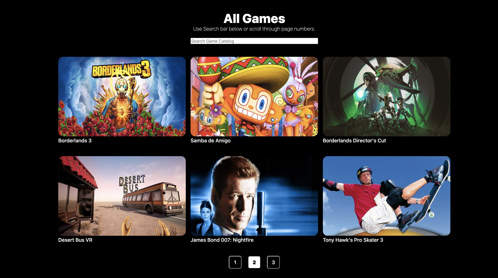
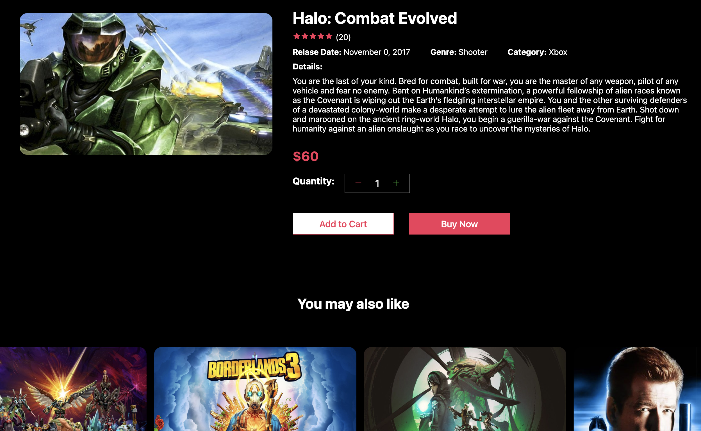
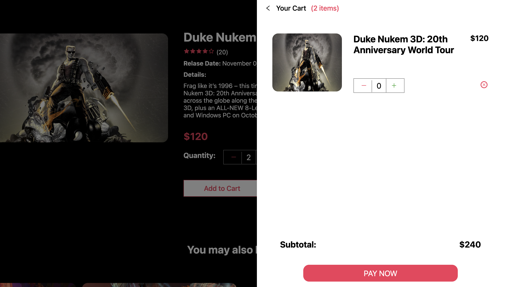
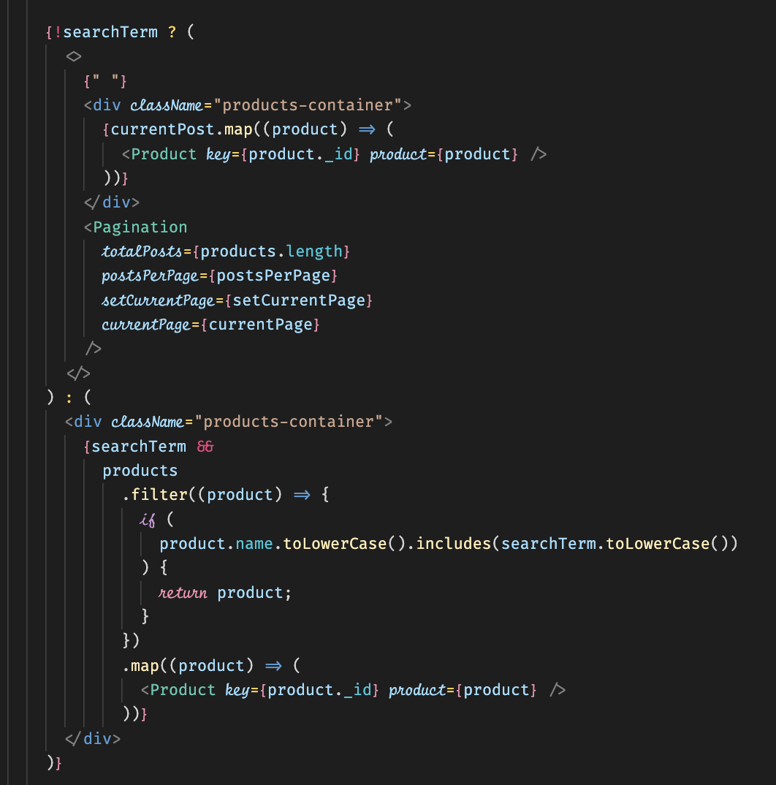

# Gearbox Store App

https://gearbox.vercel.app/ 

Prompt: Develop a page that will allow a user to search for Games sold in a Game Store based on category, genre, released date, price, customer reviews, featured games - This page will list the game name, category, genre, price, discount, released date, review rating. Show 10 items per page with pagination options like Previous, Page Numbers and Next. - Develop an internal tool that will allows an administrator to add/edit/delete a game. - Please share your work in GitHub by providing tables' schema, stored procedures, SQL. Choose your preferred database server and state the reasons why you had chosen it.

Extra Credit: Show the top 10 best sellers to users. Expect high load usage page with your preferred caching mechanism and state the reasons why used it

This is a [Next.js](https://nextjs.org/) project bootstrapped with [`create-next-app`](https://github.com/vercel/next.js/tree/canary/packages/create-next-app). This Project is built with React front-end Framework. Next.js Allows this project to render all components before displaying, allowing this page and caching to be super fast. 

## Getting Started

You can see the application here: https://gearbox.vercel.app/ and edit the data here: https://jacklmbrt07.sanity.studio/desk/product 

You do not need admin privelages or an account to use the Sanity cms panel. Simply use the link above and you can update the website in real time, after a hard refresh. no redeploying necessary.  


**To use Internally**:

This app uses old install packages, so make sure to run `npm install --legacy-peer-deps` 

First, run the development server:

```bash
npm run dev
# or
yarn dev
```

Open [http://localhost:3000](http://localhost:3000) with your browser to see the result.

To see the sanity admin server: go into the sanity_gearbox folder with `cd sanity_gearbox` and `npm run dev` and go to ` [http://localhost:3333](http://localhost:3333)

## Features

There are two "pages" the homepage, and the indiviual game page. 

The Hompage:

After the Nav, and the Hero section you can find the section containing all games with pagination. Simply click the page number to go to the next or previous page.


The Search bar uses the title in the input to match the game you are looking for.


Extra Credit: List of games that have a rating of 5 points. 


The Product Page:

After clicking an image of a game from the homepage, it will take you to the product page `[slug].js` template. The template name is a next.js feature that allows the pages to be dynamically created from the data property slug. Sanity can generate slugs automatically. The Product Page shows all the game details, and a carousel of games with the same genre label at the bottom. Here you can add a game to the cart. 

The page is generated  with this code from Next.js and more can be learned here: https://nextjs.org/docs/api-reference/data-fetching/get-static-paths 
```
export const getStaticPaths = async () => {
  const query = `*[_type == "product"] {
    slug {
      current
    }
  }
  `;

  const products = await client.fetch(query);

  const paths = products.map((product) => ({
    params: {
      slug: product.slug.current,
    },
  }));

  return {
    paths,
    fallback: "blocking",
  };
};
```



The Cart does not currently support any actual purchasing. You can dynamically add and remove items from the shopping cart. To view, simply click the icon in the top right corner. 



## Sanity Schema and the Javascript Code

Sanity.io is a very simple bootstrap way to create a database. Learn more here: https://www.sanity.io/docs

You can find the schemas `product.js` and `banner.js` under `sanity_gearbox/schemas` folder. These two files contain the schemas used, Banner is just used to develop some images and text for the hero and footer. Product contains all of the objects for each individual video game. 

on `index.js` the data is grabbed asynchronously with this code (running internally will console log the json data): 

```
export const getServerSideProps = async () => {
  const query = '*[_type == "product"]';
  const products = await client.fetch(query);

  const bannerQuery = '*[_type == "banner"]';
  const bannerData = await client.fetch(bannerQuery);

  return {
    props: { products, bannerData },
  };
};
```

The index uses this important ternary that displays the games depending on whether you are searching or not. see the `Pagination.js` component. The search bar uses the .filter() method.



## Thank you

All of the images and item detail descriptions are courtesy of https://www.gearboxsoftware.com/games/ .
Everything in this project is purely for demonstrational purposes only. 

